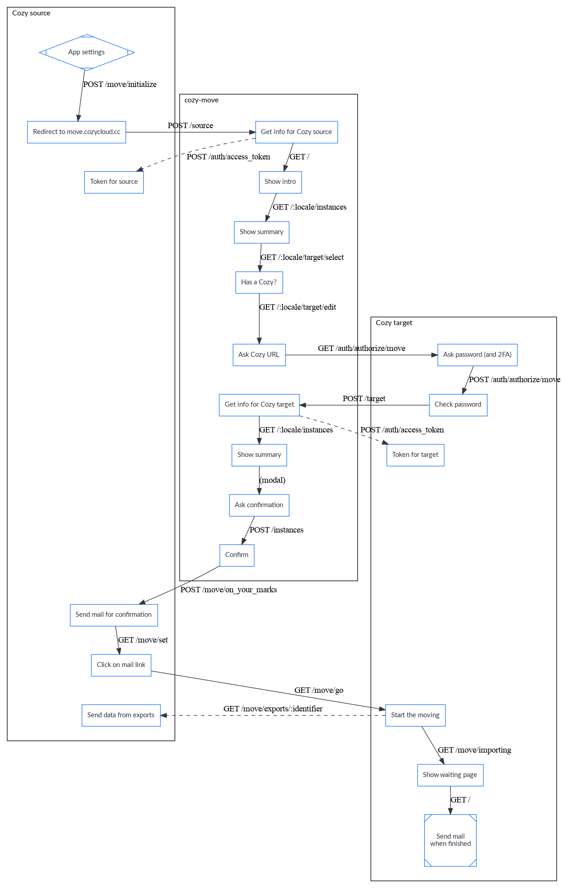
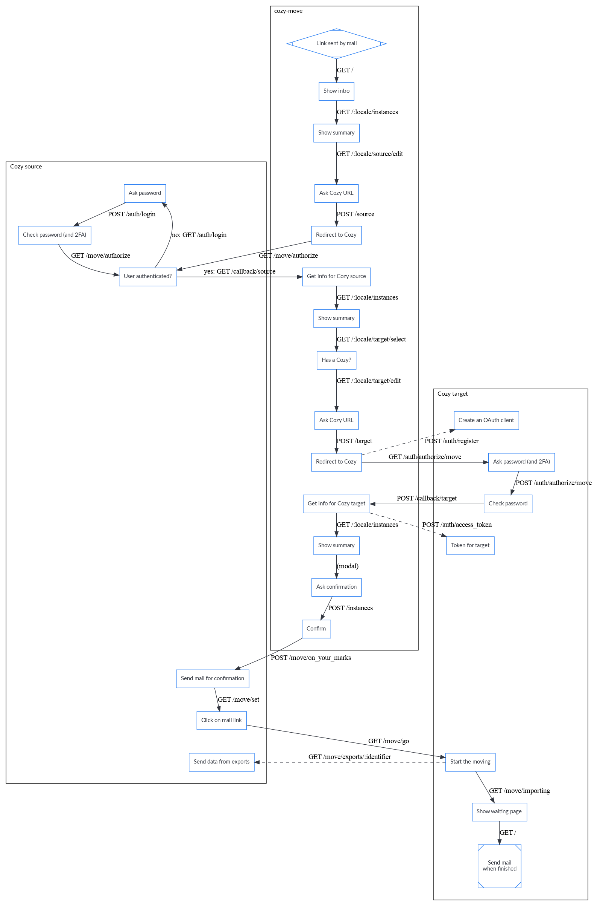

Cozy Cloud
==========

## What is Cozy?

[Cozy](https://cozy.io) is a platform that brings all your web services in the
same private space. With it, your web apps and your devices can share data
easily, providing you with a new experience. You can install Cozy on your own
hardware where no one profiles you.

## What is the Cozy-Move component?

Cozy-Move is a wizard that helps cozy users to move their Cozy from one place/hoster
to another.

## Workflows

### Starting from settings

### Starting from cozy-move

## Dev

To start your Phoenix server:

  * Install dependencies with `mix setup`
  * Start Phoenix endpoint with `mix phx.server`

Now you can visit [`localhost:4000`](http://localhost:4000) from your browser.

Ready to run in production? Please [check our deployment guides](https://hexdocs.pm/phoenix/deployment.html).

## Test

You can run tests with `mix test`. It requires `chromedriver`, which can be
installed on Ubuntu with `sudo apt install chromium-chromedriver`.

Running the tests will create screenshots in the `test/screenshots`
directory. The CI will upload them to [Argos CI](https://www.argos-ci.com/)
in order to compare them to a reference.

## Building release

To build a release including Erlang Real-Time Sytem ready to be deployed on a
production server:

  * Compile application with `ENV=prod mix compile`
  * Compile assets and generate digests with `ENV=prod mix compile_assets`
  * Create release with `ENV=prod mix release cozy_move`

Your release will live in `_build/prod/rel/cozy_move/`.
Deploy that directory to your production server and run it with
`bin/cozy_move start`. You can also build a debian package by typing
`debian/build-deb.sh -t binary`

## Learn more

  * Official website: https://www.phoenixframework.org/
  * Guides: https://hexdocs.pm/phoenix/overview.html
  * Docs: https://hexdocs.pm/phoenix
  * Forum: https://elixirforum.com/c/phoenix-forum
  * Source: https://github.com/phoenixframework/phoenix

## Community

You can reach the Cozy Community by:

* Chatting with us on IRC #cozycloud on irc.freenode.net
* Posting on our [Forum](https://forum.cozy.io)
* Posting issues on the [Github repos](https://github.com/cozy/)
* Mentioning us on [Twitter](https://twitter.com/cozycloud)
